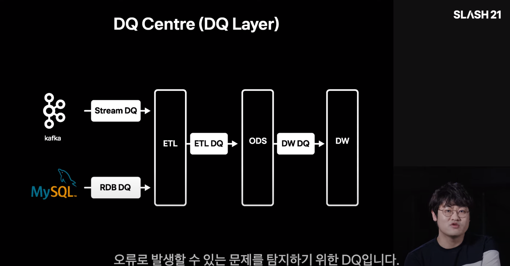

# 빠르게 성장하는 스타트업의 DW

## 토스; 애자일 조직으로 구성되는 마이크로 팀

## DB review

각 조직의 서버 개발자가 테이블을 생성 또는 변경할 경우 DBA의 리뷰를 거친다.
- DB 변경 요청을 하나의 채널로 진행
- 각 서버 개발자는 단일 채널로 DDL수행 및 데이터 변경 요청

DBA는 컴플라이언스와 데이터 모델, 성능과 안정성, 운영 효율성 관점에서 리뷰를 진행한다.
- 컴플라이언스 준수 확인(개인정보, 암호화, 권한관리 등)
- 성능과 운영효율을 고려한 인덱스 및 파티션 설계
- 용어 표준
- 데이터 모델(PK, FK, Comment)
- 신속한 대응

## 디멘젼 테이블
: 데이터의 배경이 되는 속성을 가진 테이블. Row가 적고 Column이 많은 형태. 
- 자동화를 위한 전제조건
- 주요 행위나 서비스에 대한 정의
- 각종 수수료 및 매출 계약정보 등
- 그외 수기로 관리하는 주요 설정 정보
- 집계에 하드코딩 하지 않고 디멘젼 테이블로 관리

효율적인 데이터 관리를 위해 사용. 관리 툴의 부재로 난재를 겪을 수 있으나 `Google Spreadsheet`를 사용하는 방법이 있을 수 있음. 토스에서는 자체 서비스를 운영중

## ODS 설계 및 운영
: Operational Data Store

- 집계 효율을 위해 중간 가공단계의 데이터들의 저장소
- 중간 집계용
  - AARRR 집계를 낼 때 사용
    - 이용자의 유입으로부터 매출로 연결되는 단계적 분석법
- 데이터 표준화를 위한 정규화
- ETL -> 서비스별 ODS -> 전사 통합 ODS -> OLAP(Fact Tables) 순으로 워크플로우 구성

## 효율적 분석을 위한 도구

Batch Centre라는 이름의 자체 배치잡 관리 툴을 만들어 운영
- 메타 정보 관리
- Tag 기반 사용자별 테이블 그룹핑 및 공유
- 데이터 관련 질문 및 답변
- 영향도 파악
- 주요 디멘젼 테이블 데이터 등록/수정 요청 및 승인
- Uber의 Databook과 유사한 시스템

## 데이터 품질(Data Quality, DQ)

DQ 룰 등록 -> DQ 룰 실행 -> Slack 탐지 결과 알림 및 대응이 기본 컨셉

아래의 관점으로 데이터를 분류
- RDB 제약조건: 완결성, 유일성, 유효성
- 탐지를 위해 데이터 처리 로직이 필요: 시의적절성, 정확성, 일관성

DQ를 수행하는 시점을 분류하여 DQ레이어로 구분.

- Stream DQ 및 RDB DQ: 실시간성이 필요한 DQ
- ETL: 일일 배치 ETL을 위한 DQ
- DW DQ: ODS 집계 중 오류로 발생할 수 있는 문제를 탐지

## wrap up

Risk의 크기를 고려하여 통제는 필요한 곳에 적용하며 **통제보다 빠른 탐지와 대응 우선.**

**전사차원의 효율성을 고려**하여 자동화, 체계화 진행 시기 결정.

관리 시스템 개발시 처음부터 완벽한 시스템을 만드려 하지 않는다.

