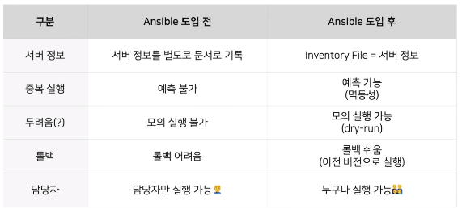

# Ansible을 이용한 서비스 인프라 관리

[영상](https://www.youtube.com/watch?v=7Ti-FwEJSg4&list=PL42XJKPNDepZbqM9N11RxL5UY_5PbA_Wo&index=17&ab_channel=TOAST)

## 인프라 관리의 어려움

1. 구축과정에서 구축하는 사람의 주관적인 의견이 개입되어, `눈송이 서버(겉보기엔 같지만 설정이 조금씩 다른 서버들)`가 생길 수 있다. 이는 같은 역할을 하는 서버에서 장애가 생겨 트러블 슈팅을 할 때 이질성 때문에 원인을 찾는 것이 힘들고, 해당 장애가 재발할 수 있다.

2. 그래서 IaaS가 도입되었다. 소스코드로 인프라를 구축할 경우 동질적인 서버를 만들 수 있다. **IaaS는 애완동물이 아닌 가축처럼 대해라.**라는 말이 있다. 이는 서버마다 한 명의 개발자가 관리하는 것이 아닌 서버의 생성/삭제/변경을 코드를 기반으로 할 수 있는 시스템을 만드는 것을 목표로 하라는 말이다.

3. `Terraform`은 대표적으로 코드를 통해 클라우드 인스턴스를 제어할 수 있다. 또한 형상관리(Git)으로 이를 관리할 수 있다.

### 만약 클라우드가 아니라면...

- 온프레미스(자체 전산실)
- 베어 메탈(물리서버 임대)

서버에 스크립트를 실행하고 인프라를 변경하며 해당 스크립트의 형상관리를 통해 인프라를 관리한다.

## Ansible
: 원격제어 및 자동화 도구. Red Hat에서 인수하여 관리중인 오픈소스. ~~깃허브스타 45k~~

### 1. SSH 기반
해당 서버에 SSH 키 파일만 존재한다면 언제든지 SSH로 관리가 가능하다.

~~반대: 에이전트 기반, 대상 서버에 에이전트를 설치해야 원격으로 가능한 시스템~~

### 2. 읽기 쉬운 문법

`ansible-playbook`이라는 명령어를 통해 대상 서벋을에 대해 원격 작업을 실행함

```s
$ ansible-playbook -i inventory playbook.yml
# inventory: 원격 제어를 할 서버에 대한 정보를 기술
# playbook.yml: 작업 내용을 기술
```
### 3. 변수 활용 가능
변수를 이용하여 인프라의 포트나 IP를 유동적으로 관리할 수 있다. 이는 `jinja2 template`를 사용한다. 

핵심 요소는 아래와 같다.

| 구분 | 역할 |
| --- | --- |
| Control Node | 제어를 하는 노드 |
| Managed Node | 제어를 받는 대상(서버) |
| Inventory file | Managed Node를 정의하는 파일 |
| Playbook | 어떤 작업들을 Managed Node에 실행할 것인지 정의한 파일(yaml) |
| Module | Playbook에서 실행할 작업의 종류를 의미 |
| Variable | 실행 결과에 변화를 줄 수 있는 변수 |

## Ansible 활용기

고려사항

1. Ansible 구조
- 개발/운영 및 서비스 환경에 따라 어떻게 Ansible 파일을 구조화할 것인가?
2. 중복 실행
- 여러 번 실행해도 동일한 결과(인프라 셋업)을 얻는가?
3. 편의성/안정성
- 누구나 쉽게 안정적으로 사용할 수 있게 할 수 있을 것인가?

### Ansible 구조
개발/운영 및 서비스 환경을 **논리적으로 장비를 구분하여 사용할 수 있다.** 예를 들어, 서버 포트를 다르게 하여 물리적으로 구분되는 환경처럼 사용할 수 있다. 

만약 서비스 규모가 커지면, **환경변수를 분리하고 실행 시점에 결정하는 방법**을 사용하여 유연하게 사용할 수 있다.

### 중복 실행 문제
`멱등성`. **여러번 적용하더라도 결과가 달라지지 않는 성질.** 최종적으로 원하는 상태를 지정하고, 해당 상태에 도달하면 변경을 하지 않게 한다. 

예를 들어 특정 디렉토리에 파일을 생성해야 한다고 가정하면, 1차 실행에서는 생성하고, 2차 실행(재실행)에서는 1차에서 진행한 파일 생성을 진행하지 않는다.

그리고 Ansible의 `커맨드 모듈(직접 명령어를 기술해야 하는 모듈)`은 멱등성을 보장하지 않는다. 이 경우, 쉘 스크립트를 작성하여 커맨드로 실행하는 방법으로 멱등성을 보장했다.

### 편의성/안정성
AWX: Ansible GUI 툴
히스토리 저장, 사용하기 쉽지만 입력값의 제한은 불가능. 그러므로 잘못된 작업을 실행할 가능성이 있었다.

그러므로 `Jenkins`를 도입했다. Jenkins Pipeline으로 Ansible을 실행하였고, 이는 Jenkins가 코드를 읽어 단계별로 실행시킨다. 또한 해당 코드의 형상관리로 작업 절차에 대한 버전 관리가 가능하다.

### Dry-run & Diff
- --check: 모의 실행(dry-run)
- --diff: 변경 부분 표시
- 사전에 예상되는 실행 결과를 미리 확인할 수 있다.
- 롤백 시에도 활용 가능



