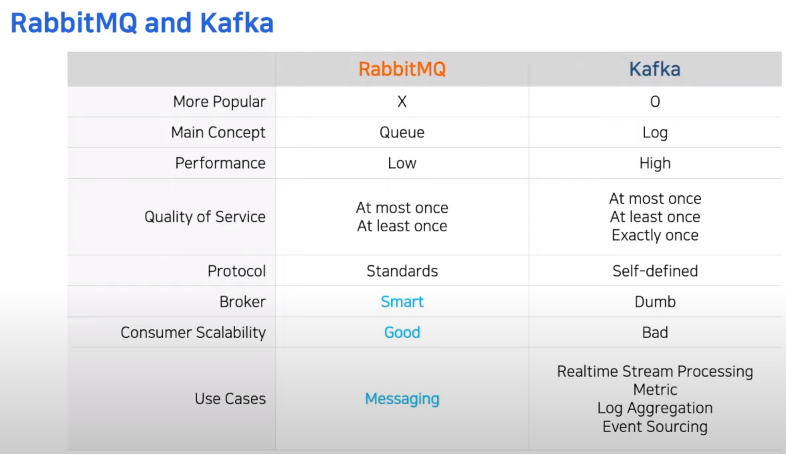

# RabbitMQ and Cloud Messaging Platform

[영상](https://www.youtube.com/watch?v=SmE_k8lqfRQ&list=PL42XJKPNDepZbqM9N11RxL5UY_5PbA_Wo&index=15&ab_channel=TOAST)

새로운 클라우드 기반 메세징 플랫폼의 필요성, 메세지 큐를 도입.

`메세지 드리븐 구조`: 서비스 사이 비동기적으로 메세지를 전달하는 것

## 카프카와 비교

> 메인 컨셉

- RabbitMQ: `Queue`, *Smart broker, Dumb broker*
  - FIFO, 소비자가 메세지를 가져가면 큐에서 삭제(일시적인 메세지 보관에 유용)
  - 생산자와 소비자의 비동기적 메세징을 위해 Queueing Buffer 역할을 함 
  - Short Term(P-C 문제에서 자원을 가져가면 생명을 잃음)
  - Loose coupling
  - 메세지 상태를 모두 관리, 비교적 낮은 성능
  - 큐에 메세지가 머무르는 시간이 짧을수록 성능이 좋도록 구현
- Kafka: `Log`, *Dumb broker, Smart consumer*
  - 메시지 영속성(persistence) 보장
  - 다시 읽을 수 있음(replay)
  - 소비자가 어떤 메세지를 읽었는지 관리하지 않음(소비자가 관리)
  - Tight coupling
  - 비교적 높은 성능

의존성을 적게 가져가는 플랫폼을 만들기 위해 Consumer의 Scale in/out에 비중을 두었다.

> QoS, 메시지 전달 수준 보장

- `At most once`: 메시지 전달에서 손실이 발생할 수 있음
- `At least once`: 중복 가능성이 있는 메시지 전달 보장 수준. 메시지 수신을 알기위해 큐에 메시지를 유지하는데, 소비자가 보내는 ACK가 네트워크 이슈로 인해 전달되지 않으면, 같은 메세지를 다른 소비자에게 전달되어 중복이 발생할 수 있다.
- `Exactly once`: 손실과 중복 없이 메시지 전달. `Transaction`을 사용하기 때문에 성능 저하.

NHN Notification에서는 메시징 서비스 QoS를 `At most once` 손실 수준으로 선택했다. 메시지 서비스 특성상 중복이 더 위험하다고 판단했기 때문.

> 프로토콜

- RabbitMQ
  - AMQP
  - MQTT
  - STOMP
- Kafka
  - 자체 구현한 TCP 바이너리를 사용
  - 400개가 넘는 커넥터들

> 사용성

- RabbitMQ
  - Standalone
  - 경량
  - 빌트인 관리 콘솔
- Kafka
  - Zookeeper 사용 필수(추후 걷어낼 예정)

> 사용 사례

- RabbitMQ
  - 메세징
  - Pub/Sub
- Kafka
  - 실시간 스트리밍 처리
  - 메트릭
  - Log aggregation
  - 이벤트 소싱
  - Pub/Sub

즉, Producer, Broker, Consumer간 낮은 의존성, 메시징 적합성을 고려한 결과 RabbitMQ를 선택했다. 그러나 최근 메트릭이나 통계 등 Kafka가 적합한 곳도 생겨나고 있어 도입을 검토중이다.

## 개선 사례

이전에는 알림을 DB에서 읽어왔다. 이 경우 DB가 병목이 걸리는데, DB의 성능을 높이려 수직/수평적 확장이나 샤딩을 고려할 수도 있다. 그러나 더 확장성 있고, 탄력적인 플랫폼을 만들기 위해 비동기 메세지 큐를 도입했다.

클라우드는 기본적으로 Multi-tenancy이다. 이는 여러 사용자가 인프라나 애플리케이션에 인스턴스 리소스를 공유하는 것이다. 만약 특정 고객사가 많은 자원을 점유하여 다른 서비스의 원활성을 해치는 경우 이를 Noisy neighbors Effect 라 한다.

이를 해결하기 위해 RabbitMQ의 Dynamic Create/Delete를 사용했다. 각 고객사들이 하나의 메시지 큐를 가지게 했다. 

RabbitMQ는 기본적으로 메시지가 라우팅되지 않아도 실패 응답을 하지 않는다. 응답을 받기 위해서는 `Mandatory` 기능을 이용해야한다. 

특정 시간동안 자원을 사용하지 않는다면 삭제하는 방식을 채택하기로 했다. 이는 큐마다 TTL을 설정했고, TTL이 만료되면 RabbitMQ에 의해 큐가 자동으로 삭제된다. 새로운 메세지가 들어오거나 소비가 되면 TTL이 갱신된다. 만약 오류로 인해 큐에 메시지가 남았지만 큐가 삭제된다면, 메시지를 자동으로 이동시켜주는 `Dead Letter Exchange(DLX)` 기능을 적용했다.

## 기타 설정

1. 네트워크 파티션 핸들링
- pause-minotiry. 마이너한 쪽이 멈춤

2. 큐 밸런싱
- client local

3. 고가용성
- 3개 노드에 Queue를 복제, 

4. 메모리
- vm_memory_high_watermark.relative = 0.4 (VM 전체 메모리 40%를 Queue에서 사용. 넘어가면 메시지 발행을 받지 않음.)
- vm_memory_high_watermark_paging_ratio = 0.75 (메모리의 메시지를 디스크로 쓰는 것. Queue의 메모리 중 75%가 도달할 경우)

