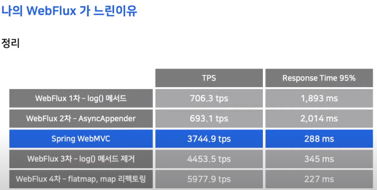

# 내가 만든 WebFlux가 느렸던 이유

[영상](https://www.youtube.com/watch?v=I0zMm6wIbRI&list=PL42XJKPNDepZbqM9N11RxL5UY_5PbA_Wo&index=2&ab_channel=TOAST)

WebFlux로 만든 API서버의 성능측정 결과와 향상을 위해 노력했던 것들

광고서버는 빠른 응답속도와 높은 처리량이 필요하다. Redis, Spring WebFlux가 적합했다고 판단했기 때문에 이를 선택했음.

## Spring MVC vs WebFlux

Spring MVC: Thread per Request Model. 즉, 요청마다 스레드풀에서 하나의 스레드를 빌려 사용한 후 반납하는 방식. Spring Boot와 Tomcat의 기본 설정을 따른다면 스레드는 200개임.

일반적인 분산 시스템의 경우 한 API 서버에서 다른 API 서버로 데이터를 요청하는 일이 잦은데, Spring MVC는 한 스레드가 해당 요청을 모두 담당하기 때문에 다른 서버로 데이터를 요청하고 기다리는 동안에는 Waiting 상태가 됨. 하지만 시스템의 부하가 높은 상태에서 스레드의 상태가 Runnable에서 Waiting으로 바뀌는 것(Context Switching)이 되고 스레드의 데이터가 계속해서 로딩하는 오버헤드가 문제가 됨. 

또한 (MVC 기본 설정인)200개의 스레드가 CPU 코어를 점유하기 위해 race condition이 발생. API 개발자들이 사용하는 머신 Core 수는 4~8개 정도인데, 200개의 스레드가 4~8개의 코어를 점유하기 위해 race condition이 발생하는 것도 큰 오버헤드임. 

WebFlux는 EventLoop로 처리. 리액터 라이브러리와 Netty를 기반으로 동작. EventLoop가 돌며 EventQueue에 쌓인 작업을 처리한다. Netty의 스레드풀의 스레드 수는 머신 코어의 두 배이다.

높은 처리량이 가능한 이유는 EventLoop와 Non-blockinng I/O를 사용하기 때문. 다른 일을 할 수 있는 프리한 스레드가 많다. 먼저, 스레드 풀이 적기 때문에 CPU 사용량이 높은 작업이 많거나 Blocking I/O 프로그래밍을 한다면 EventLoop가 빠르게 EventQueue의 Event를 처리할 수 없다. 이는 Runnable Thread가 CPU 코어를 점유하기 때문이다. 

## 성능 개선을 위한 코드 수정

코드 자체에 문제가 있었음.
- .log()의 사용: 로깅을 하는 것 자체는 blocking임. async WebFlux에서 성능 저하를 발생시킴
- .map() 체이닝: map이 너무 많음
- .map()과 .flatMap()의 차이:  map은 동기식, flatMap은 비동기로 처리하는 함수임. 또한 중간에 Redis에서 데이터를 가져오는 부분이 있는데, Reactive Redis는 Non-blocking I/O에 비동기로 동작해야하나 map을 사용해서 동기적으로 처리했었음.

~~비동기식 Non-blocking에서 동기식 로깅은 절대 하지 말자~~

## 성능 scatter 그래프에서 팁
- 하단에 공간이 뜬다면 이는 동기식으로 동작하는 코드가 있다는 것을 암시
- Lazy connection 으로 인해 처음 응답/처리는 데이터가 튈 수 있음
- 첫 실행 때 JIT complier의 최적화가 있으므로 데이터가 튈 수 있음. 그 다음 실행부터는 안정적을 변함
 
## 추가 정보
- BlockHound 라이브러리 
  - Blocking 코드를 찾아주는 라이브러리
  - reactor-core 3.3.0 부터 내장
  - block(), blockFirst(), blockLast()를 사용하면 예외 발생
  - TC 작성할 때 사용
- Lettuce 설정
  - Redis Connection을 맺은 후 ping command가 동기식으로 동작할 경우 심각한 성능 하락의 원인이 됨
- Avoiding Reactor Meltdown(from infoQ)
  - 가능하면 모든 코드는 비동기 논블로킹으로 구현
  - 하지만 블로킹 코드가 실행할 필요가 있음
  - 그럴 경우, 블로킹 코드 실행을 위한 스레드풀을 따로 만들어서 구현
