# AWS: Monolithic to Micro service

https://www.youtube.com/watch?v=_8ylg-DLnBY

## 왜 MSA?

모놀리식 앱 개발 및 배포 아키텍처는 하나의 소스 레포, 하나의 데이터 스토어, 하나의 애플리케이션으로 개발한다. 이 상황이 장기화 되면 유저 수가 증가하고, 팀의 크기가 커지면서 여러 개발자가 하나의 애플리케이션을 고도화하거나 디버깅하게 되는데, 이는 확장성을 저하하고 개발 사이클을 늘리며, 운영이 어려워진다.

## 넷플릭스의 MSA 도입

넷플릭스는 `SOA, Service Oriented Architecture`를 클라우드 기반의 작은 단위의 서비스를 만들어 API를 통해 제공을 하고있다.

## MSA의 정의

- 독립적인 비즈니스 모델을 가진 SOA가 네트워크 통신을 통해 서비스를 제공하는 아키텍처

## 하나의 MSA 구성 패턴

- 데이터 스토어(DB, Cache)
- Application/Logic(code, libraries, etc)

## AWS 기반 마이크로 서비스 아키텍처 패턴

### 전통적인 클라우드 서비스 아키텍처

### 마이크로 서비스 아키텍처

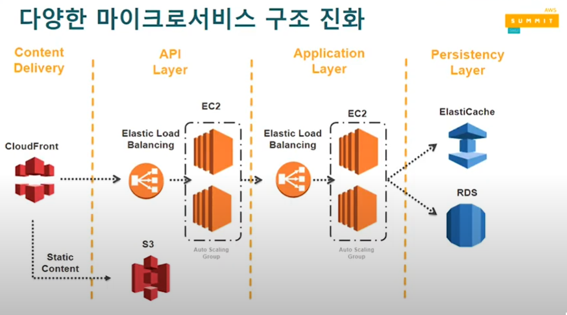

### API 게이트웨이를 추가한 아키텍처

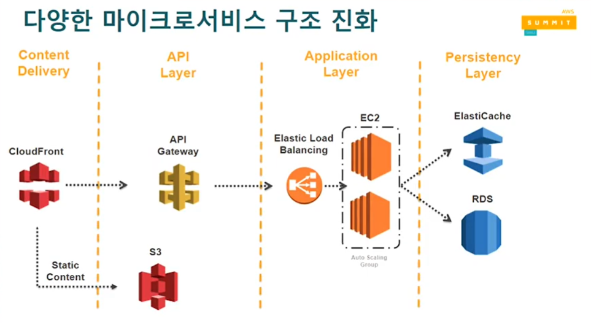

### 애플리케이션 레이어를 컨테이너로 바꾼 아키텍처

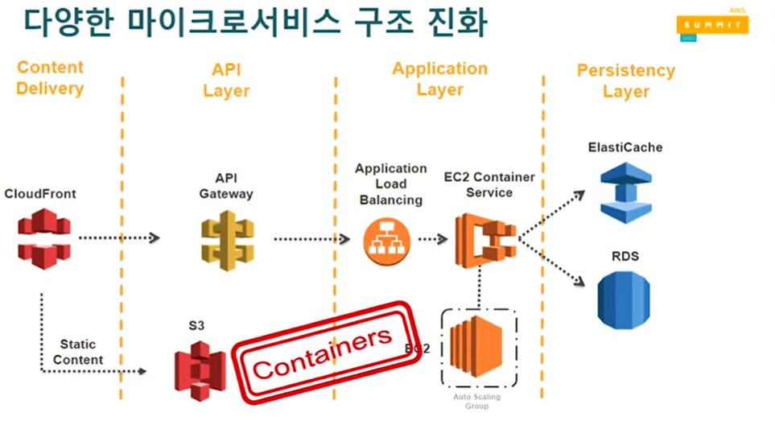

### 애플리리케이션 레이어를 서버리스(Saas) 로 바꾼 아키텍처

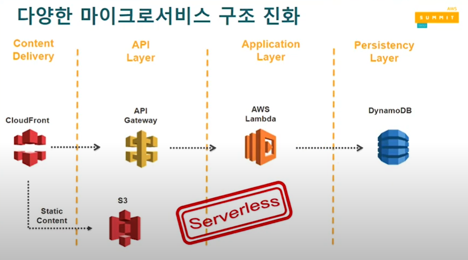

### 그 외 다양한 패턴

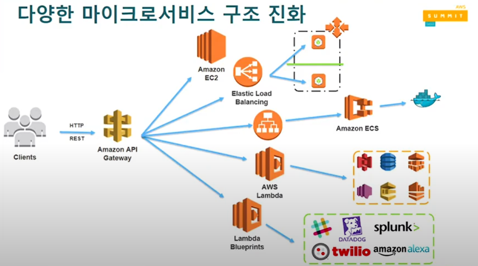

## 빙글

4년동안 한 레포에 2만개가 넘는 커밋이 있었다. 이 레포에는 아래의 내용이 모두 포함되었다.

- 한 레포에 FE + BE
- 아키텍처
  - 웹서버
  - 백그라운드 워커
  - API
  - ORM
  - 비즈니스 로직
- 기능
  - 피드
  - 검색
  - 카드 작성
  - 관리자
  - 스팸

그러므로 유닛 테스트를 진행한다고 해도 30분이 걸렸고, 배포에도 도커라이징, 빌드 등의 시간을 고려했을 때 30분이 넘는 시간이 소요됐다.

### 문제점

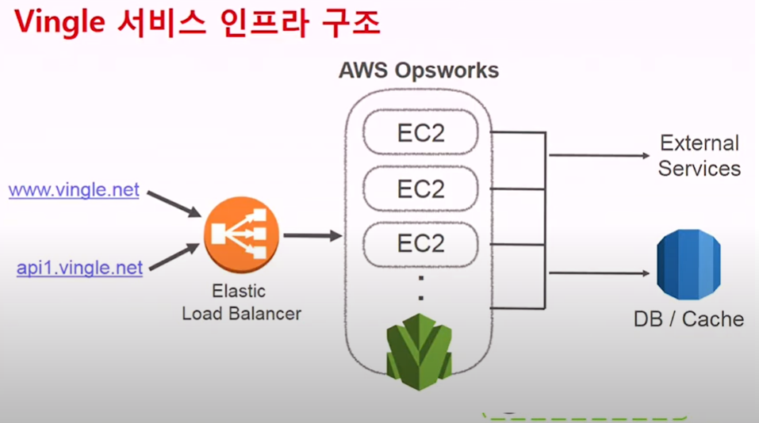

기존 아키텍처

- 언제나 모든 서비스를 함께 배포/스케일링
- 새로운 기술 도입이 어려움
- 기술적으로 자유로운 사고가 어렵고 생산성이 저하됨

### 목표

- 독립된 스케일링
- 독립된 배포
- 독립된 기술 스택(FE, BE 분리)
- 독립된 개발
- 독립된 테스팅, 모니터링

### 서버리스 기반 유닛별 신규 아키텍처(템플릿 만들기)

마이크로 서비스라는 개념이 좋은 것은 모두 알지만, 그 기능을 도입하기는 매우 어려웠다고 한다. 이유는 각 서비스 도메인별로 기능들을 분리하고, 관리해야 하기 때문인데 이를 프로그래밍적으로 할 수 있는 방법을 고안해 낸 것이 일종의 `MSA 템플릿`이다. 

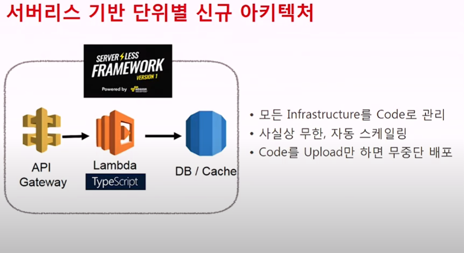

앞 단에 API 게이트웨이, 람다를 기반으로 컴퓨팅 엔진이 아닌 단순 SaaS 만 storage와 연결시켜 제공하는 구조를 사용했다.

또한 AWS 서비스들은 CloudWatch 로 모니터링이 가능하기 때문에 해당 API를 호출하여 쉽게 파악할 수 있었다.

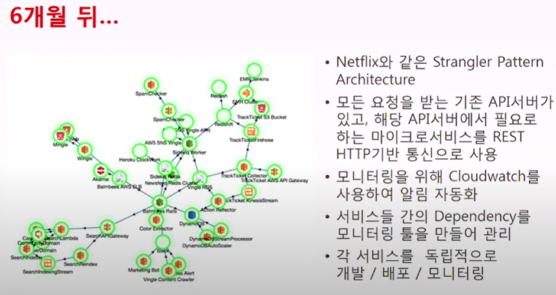

결국, 이러한 템플릿을 필요한 서비스의 갯수만큼 만들어 전체 API 게이트웨이를 두고, 요청을 파악하여 해당 서비스의 API를 호출, 서비스에게 데이터를 요청하고 클라이언트를 제공하는 패턴을 구현했다. 이를 `Strangler Pattern`이라 한다.

그리고 서비스의 수가 많아질 수록 각 서비스들의 dependency 파악이 어렵다고 생각했다. 다이어그램을 그려 한 눈에 파악하기 쉽도록 했다.

## 이 과정에서 배운것들

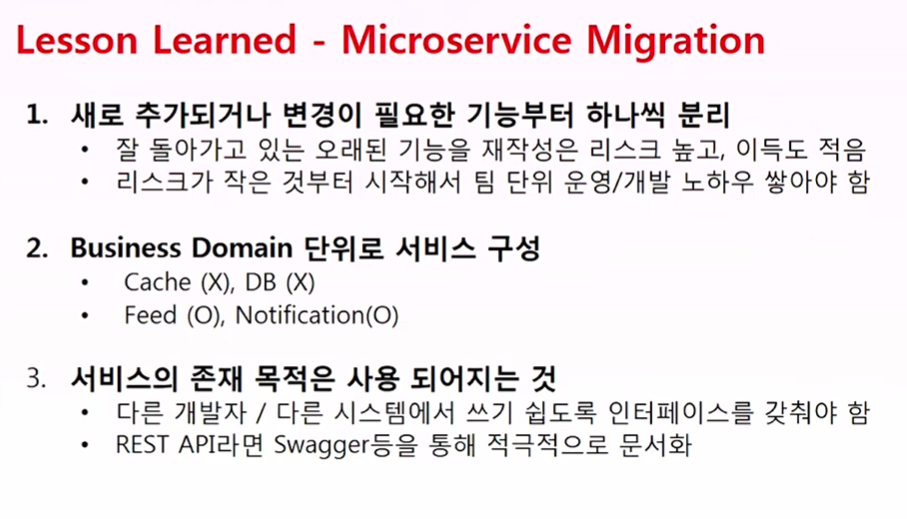

## 모범사례 01: API 기반 서비스 인터페이스 및 하위 호환성 유지

Semver: AWS Lambda 의 버전 기능이 존재. 배포 버전을 선택 가능
API Gateway: 스테이징 기능과 스테이징 변수 기능 활용

## 모범사례 02: 각기 다른 폴리그랏(Polyglot) 개발 및 운영 환경

폴리그랏: 다양한 개발 환경(이벤트 기반은 Node.js, 도메인 기반은 Java 등...)

### 폴리그랏 MSA의 특징

- 각자의 스토어를 갖게됨
- 각자의 API를 연결하여 필요한 서비스를 호출하게 됨

### 만약 트랜잭션 중 문제가 발생한다면?

- 모놀리식: 전체 서비스 다운
- MSA: 일부 서비스만 다운, 피해 최소화

### 해결 방법

1. Correlation ID 활용

환경변수 같은 값을 넘겨줘서 해당 값들이 잘 넘어가고 있는지 log를 통해 확인

2. 서비스별 자체 롤백 제공

- 모든 MSA는 각자 롤백 기능을 가져야한다.
- 롤백이 필요할 경우 알림이나 특정 액션에서 롤백 기능 제공
- Correlation ID를 기반으로 롤백 알림 호출

3. AWS Step Functions

여러개의 Lambda로 flow를 만들어 서비스

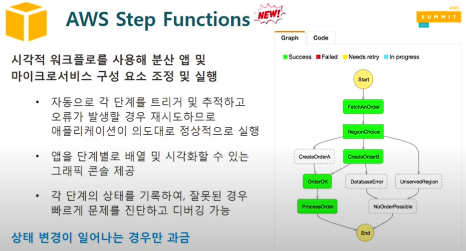

아마존 Rekognition 예제

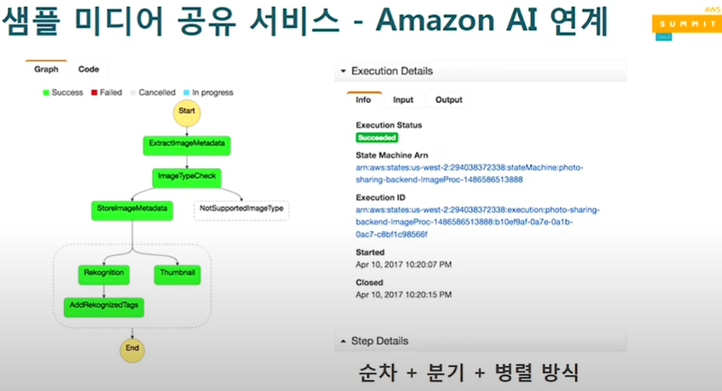

## 모범사례 03: 모니터링

- API 외부적인 요소 모니터링: Latency, RPS, ERROR rate
- API 내부적인 요소 모니터링: CloudWatch, OS, Application

AWS에서는 CloudWatch 및 CloudWatchLogs 활용

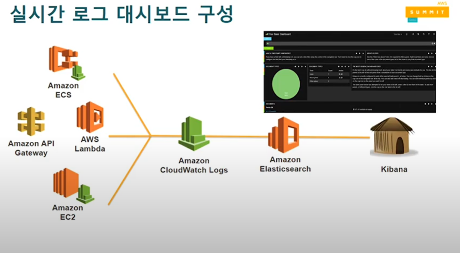

실시간 로그 대시보드 구성(MSA에 대해)

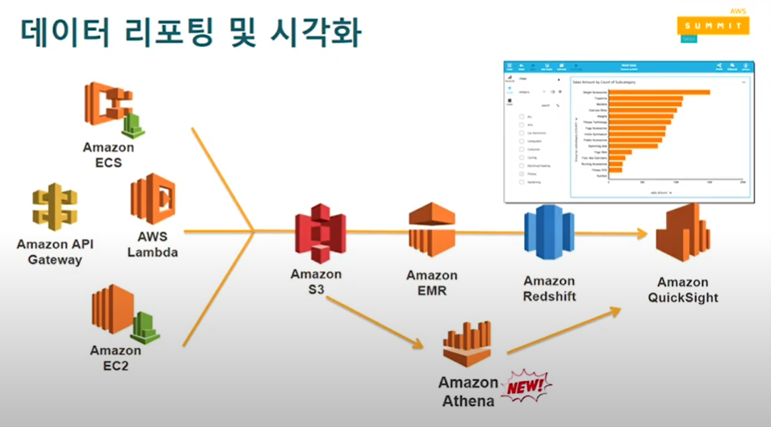

S3에 데이터를 쌓았다면 Athena를 통해 모니터링이 가능

### AWS Lambda 코드 에러의 경우

- Cloudwatch Logs를 통해 디버깅이 가능
- 직접 트랜잭션 매니저 함수를 별도로 만들어 Cloudwatch Logs Metric filter를 통해 에러 검출

### AWS X-Ray

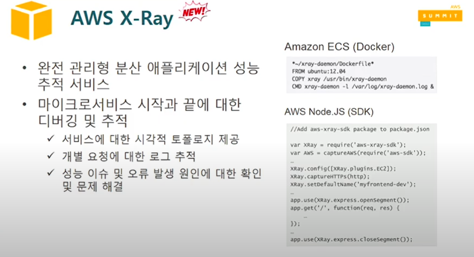

애플리케이션 성능을 확인하고 에러를 확인하기 쉬움

## 모범사례 04: 마이크로서비스별 보안 강화

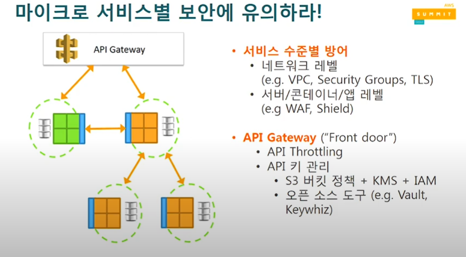

## 모범사례 05: API 서비스를 통한 생태계 확산, 비즈니스 가치 창출(외부로 API 오픈)

1. API Gateway Developer Portal

Serverless Application Model (SAM) 기반의 오픈소스 키 발급 및 관리 백엔드

2. API Monetization in Marketplace (API 판매)

## 모범사례 06: 기술 너머 조직 변화

Conway's Law: 애플리케이션은 해당 조직과 닮아있다. MSA를 도입하면 기능별 조직에서 자율성 높은 책임 조직으로 변하게된다. 

MSA의 도입으로 해당 조직에서 서비스를 위한 가장 효율적인 서비스 아키텍처를 기용할 수 있다.

## 모범사례 07: 자동화

자율성 높은 팀들이 각자의 환경과 서비스를 만들어 운영하고 배포하는 것은 중요하다. AWS에서 DevOps 도구들을 지원한다.

- [CloudFormation](https://aws.amazon.com/ko/cloudformation/): 클라우드 인프라 리소스 모델링 및 프로비저닝 도구
- [Config](https://aws.amazon.com/ko/config/): 리소스 구성 측정, 감사 평가 도구
- [CloudWatch](https://aws.amazon.com/ko/cloudwatch/): DevOps 엔지니어, 개발자, SRE(사이트 안정성 엔지니어) 및 IT 관리자를 위한 모니터링 및 관찰 기능 서비스
- [CloudTrail](https://aws.amazon.com/ko/cloudtrail/): AWS 계정의 거버넌스, 규정 준수, 운영 감사, 위험 감사 지원 도구
- [CodePipeline](https://aws.amazon.com/ko/codepipeline/): 릴리즈 파이프라인 도구
- [CodeDeploy](https://aws.amazon.com/ko/codedeploy/): 배포 자동화 도구
- [CodeStar](https://aws.amazon.com/ko/codestar/): CI/CD 통합 도구
