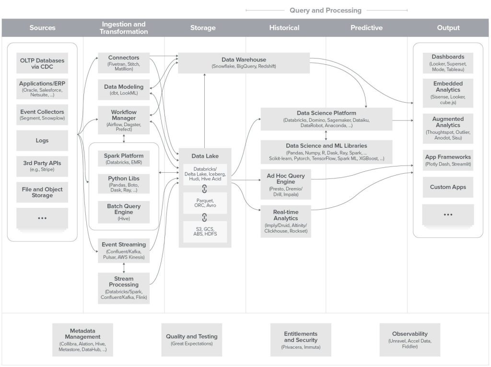
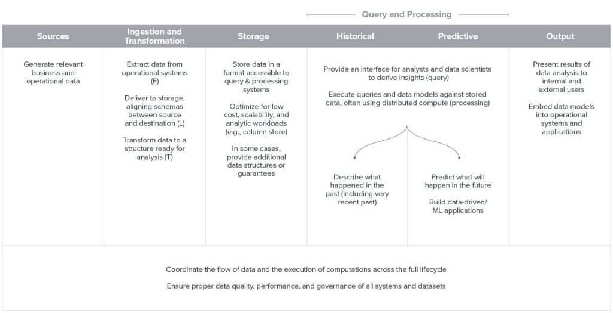
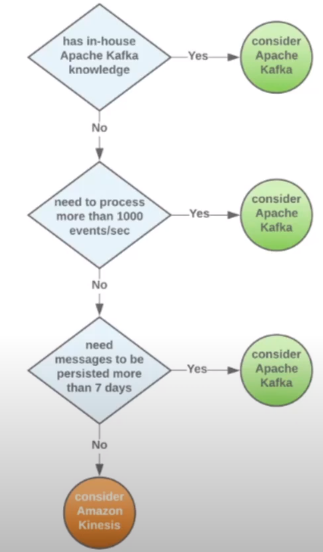

# 최신 데이터 인프라 이해하기

[원본](https://a16z.com/2020/10/15/the-emerging-architectures-for-modern-data-infrastructure/)
[영상출처](https://www.youtube.com/watch?v=g_c742vW8dQ)

| 01

데이터가 흐르는 제품을 판매하고, 데이터를 다루는 조직이 되려면 데이터 인프라스트럭처가 필요하다. 하지만 이 인프라는 한 번의 클릭으로 만들어지는 것이 아니다. 다양한 기술과 오픈소스, SaaS들이 유기적인 관계를 가지며 하나의 인프라를 구성하게된다.

### 데이터 인프라의 목적

데이터 기반의 의사 결정을 돕기위한 분석 시스템 구축

서비스/제품을 데이터의 도움을 받아 향상 

### 데이터 인프라 기초

> 일반론

일반적으로 기업은 각각의 프로덕션 시스템(CRM, ERP, DB)에서 각각의 분석 시스템을 사용하여 결과물을 산출한다. 하지만 이것은 분산되어있으며 하나의 결과물로 산출하려 할 경우가 생긴다.

**데이터 웨어하우스**는 통합된 분석 보고서 작성을 위해 다양한 소스로부터 데이터를 저장하는 저장소를 말한다. 

> 데이터의 차이

프로덕션 시스템은 각각의 데이터가 모두 정규화(normalization)되어있다. 이는 각 시스템에서 필요한 데이터를 즉시 사용하기 위함인데, 이는 통합된 보고서를 만들기 위해서는 불편함이 있다.

데이터 웨어하우스는 더 작고 간단한 테이블의 구조를 가지며 이를 Dimensional Schema라 한다. Star schema라고도 한다. 특정 데이터를 분석하려 할 때는 데이터 웨어하우스가 더 편리하다. 프로덕션 시스템은 서비스 운영을 위해 즉시 데이터를 업데이트 해야하지만, 분석 시스템을 위한 데이터 웨어하우스는 성질이 다르다. 

> ETL? ELT?

- **E: Extract(추출)**
  - 프로덕션 시스템으로부터 분석을 위한 데이터를 추출한다.
- **T: Transform(변환)**
  - 원하는 형태로 변환한다.
- **L: Load(적재)**
  - 데이터 웨어하우스에 적재한다.

ETL의 문제는 E-T 가 자동화가 되지 않는다는 것이다. 또한 분석의 조건이나 형태가 달라지면 수정이 다수 필요하다. 

그래서 최근은 ELT로 변경되었다. E-L은 자동화가 가능하다. 그 후, 변환은 따로 한다.

### 데이터 직종

- **데이터 분석가**
  - 데이터를 해석해서 비즈니스 의사결정을 돕는 정보를 만드는 사람
  - 통계학, 수학, 스프레드시트 및 DB, BI도구
- **데이터 엔지니어**
  - 빅데이터를 처리하는 데이터 인프라스트럭처를 만드는 사람
  - 프로그래밍, 빅데이터, 데이터베이스, ETL및 BI도구
- **데이터 과학자**
  - 수학자+과학자+도메인전문가. 큰 데이터를 잘 다루고 복잡한 문제를 해결하는 사람
  - 데이터 시각화, 모델링, 분산 컴퓨팅, 딥러닝, ML, 스토리텔링, 커뮤니케이션...

원본 사이트에서 가져온 도표이다. 굉장히 복잡하다. 먼저, 각 컬럼들에 대한 설명을 하려한다.

- Source: 데이터가 만들어지는 곳
- Ingestion and Transformation: 데이터를 가져와서 변환
- Storage: 저장소
- Historical: 과거의 데이터
- Predictive: 미래 예측
- Output: 비즈니스 의사결정을 위한 BI 도구

| 02

## Source 

### OLTP DB via CDC

- **OLTP**: 온라인 트랜잭션 처리
  - 서비스를 위한 실시간 데이터베이스 처리
  - 대용량 트랜잭션 처리
  - 빠른 처리를 위한 정규화된 데이터
- **OLAP**: 온라인 분석 처리
  - 데이터 분석을 위한 분석 처리
  - 대용량의 데이터를 사용
  - 비정규화된 데이터
- **CDC(Change data capture)**
  - 업데이트된 데이터만 감지하여 분석 데이터베이스로 전달 

### Applications/ERP
기업에서 발생하는 자원의 변경으로 인한 데이터

- 오라클(+ Netsuite) ERP
  - 전사적 자원 관리. 즉, 기업에서 일어나는 모든 자원들의 변경 이력을 갖는 것
- 세일즈포스(Saleforce)
  - CRM(고객 관계 관리) 툴
  - 판매, 마케팅 등

### Event Collectors
사용자가 발생시키는 데이터를 모아주는 툴

사용자의 행동 분석을 위한 툴들
  - 구글 애널리틱스
  - 페이스북 픽셀
  - 세일즈포스

등은 각각의 API 게이트웨이를 가진다. 비즈니스 사이드에서 관리하기 쉽도록 통합하여 이벤트를 하나의 게이트웨이를 거칠 수 있도록 하는 툴이 이벤트 콜렉터이다. 즉, 이벤트 콜렉터는 모바일, 데이터 웨어하우스, 웹 등 사용자의 이벤트가 발생하는 소스들을 하나의 게이트웨이를 통해 각각의 분석도구로 데이터를 넘겨주는 역할을 한다.

- Segment: 가장 유명한 이벤트 콜렉터
- Snowplow: 오픈소스
- Rudderstack: 오픈소스. Replay(아카이브된 데이터를 넣어서 분석할 수 있다.)

### Logs
서버의 로그들

CDN, LB, Web server logs...

### 3rd Party APIs
: 서비스를 운영하는데 필수적인 서드파티 API. 

예를들어 온라인 결제 서비스. 한국에서는 pg들.

### File and Object Storage

| 03 

## Ingestion and Transformation

### Connectors
: Source에서 발생한 데이터를 데이터 웨어하우스 또는 데이터 레이크로 전달하는 도구

- **Fivetran**
  - Source의 데이터들을 정규화하여 분석이 가능한 데이터로 저장하는 도구
- Stitch
  - ETL도구
- **Matillion**
  - Matillion data loader: EL을 무료로 사용할 수 있음.
  - BI 도구도 지원한다. 

| 04 

### Data modeling tools

- dbt: data build tool. **데이터 분석가들을 위한 엔지니어링 툴**
  - 실제 데이터로부터 snapshot 후 최적의 분석을 위해 데이터 모델링이 가능
  - VCS 지원
  - Fivetran에서도 dbt를 지원
- Looker(BI도구)의 LookML

### Workflow manager

- **Apache Airflow**
  - 태스크 스케줄링
  - 분산 실행
  - 의존성 관리(태스크 처리 순서 관리)
  - 파이썬 코드로 만들어져있어, 확장이 쉽다.
  - 템플릿도 많다.
- Dagster
  - 데이터 애플리케이션을 개발하여 어디서든 실행할 수 있도록 할 수 있는 툴
- argo
  - 쿠버네티스 환경에서의 workflow manager
- prefect
  - workflow automation engine

| 05

### Spark
: 대규모 데이터 처리를 위한 분산 분석 엔진

> Hadoop vs. Spark

- 하둡
  - 마스터 노드에게 일을 주면 이를 슬레이브에게 나눠서 처리한 후, 서버로 보내서 다시 map reduce...
  - JVM기반의 HDFS를 사용. 즉 I/O가 계속 발생
  - batch job only
- 스파크
  - 인메모리 캐싱
  - 다목적 데이터 처리
  - RDD(Resilient Distributed Dataset)
    - read only
    - 데이터의 계보(lineage)만 기록해도 fault-tolerant
  - lazy execution: 자원을 배치한 후 마지막에 실행하므로, 실행의 최적화가 가능

> Data bricks

- 스파크를 핵심으로 사용하며, 필요한 분석도구 및 매니지드 도구들을 솔루션화한 것.
- 클라우드 서비스에 솔루션으로 제공

### Hive

- 하둡의 쿼리 엔진
- Meta store: 연결된 데이터베이스의 정보를 저장
- Spark를 사용하여 HDFS 데이터들을 사용할 수 있도록 해주는 일종의 어댑터로서 역할을 수행할 수 있음

### 파이썬 라이브러리

- **pandas**
  - 파이썬 데이터 분석 및 조작 도구
  - 표 데이터(Data frame이라 함)를 주로 다룸
  - 다양한 형식의 데이터를 Data frame에 맞게 Load, Transform 후 export가 가능한 라이브러리
- boto3
  - 파이썬으로 AWS의 리소스를 사용할 수 있도록 해주는 라이브러리
- **Dask**
  - 파이썬을 네이티브 스케일링 하는 도구(병렬처리)
  - 중앙 스케줄링
  - 데이터 사이언스에서 데이터 프레임을 분산 처리
- **ray**
  - 파이썬 분산 컴퓨팅 서포트 도구
  - 분산 스케줄링 
  - 머신러닝할 때 사용

| 06

### 스트리밍 데이터

데이터 인프라에서 스트리밍이 중요해졌다. 그 이유는 데이터 가용성 때문이다. 

- 클라우드 이전: 어떤 데이터를 언제, 누가 접근하게 할 것인가가 중요한데 클라우드 이전에는 클라우드를 사용하지 못 했기 때문에 한정된 데이터를 사용해야했다. 그렇기 때문에 엄격한 스키마와 ETL에서 L(적재)할 때만 데이터 접근이 가능했고, 이는 BI 도구들을 통해서만 접근할 수 있었다.
- 하둡을 이용한 배치 시스템: 스키마가 조금은 널널해졌지만 적재 할 때만 데이터 접근이 가능하다. 그러나 BI도구 뿐만 아니라 파이썬 등의 프로그래밍 언어를 통해 접근이 가능해졌다.
- 스트리밍: 데이터를 ingestion(추출) 하는 시점부터 접근이 가능하며, 여러 도구들을 통해 접근이 가능하고, 데이터의 스키마가 제한적이지 않다.

- **Apache kafka**: 오픈소스 분산 이벤트 기반 스트리밍 플랫폼. 
  - Writing에 최적된 스트리밍 서비스를 만들어서 이름이 kafka(소설가 이름)
  - Pub/Sub 메시징 기반
    - 수많은 서버로부터 지표를 모아 Pub/Sub 구조의 통합 Gateway를 통해 Subscribe 하고있는 컴포넌트(모니터링, 지표 분석 등)에게 데이터를 전달하는 방식
  - Producer-Consumer 기반
    - 컴포넌트들로부터 생성된 데이터를 Queue에 적재하여 Consumer에게 전달하는 방식
  - 사용처
    - 실시간 웹/로그 분석
    - 메세징
    - 트랜잭션, 이벤트 소싱
    - 마이크로 서비스 분리
    - 스트리밍 ETL
  - 문제점
    - 셋업 자체가 어려움
    - 클라우드에 올리는 것도 어려움
    - 커넥터가 필요
    - 수평적 확장이 가능하나 축소가 어렵다(전체를 따로 복제한 후에 줄여야한다.)
- **Confluent**
  - Kafka를 만들던 사람들이 만든 Kafka 솔루션 회사
  - Community 버전이 있어 무료로 사용이 가능하며, 유료 결제로 엔터프라이즈 서비스도 지원
  - pre-built connector 지원
- **Apache Pulsar**
  - Yahoo에서 만든 **클라우드 분산 메세지 스트리밍 플랫폼**
- **Amazon Kinesis**
  - AWS에서 만든 매니지드 메시지 스트리밍 서비스
  - 카프카에 비해 제약이 많지만 스케일링이 쉽다.(줄이는게 가능하다)
  - 성능상으론 많이 뒤쳐진다.
- **Amazon MSK(Managed Streaming for Kafka)**
  - 완전 관리형 kafka
  - 

~~앗..아앗..~~
