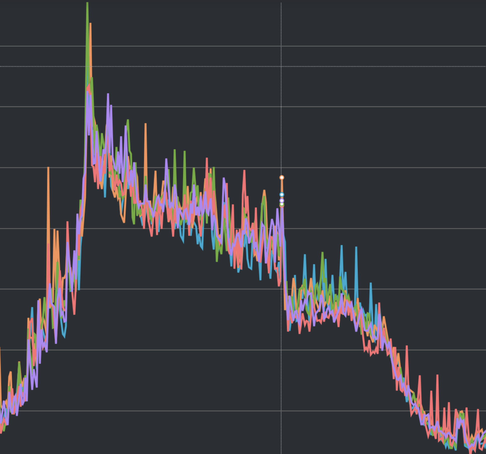
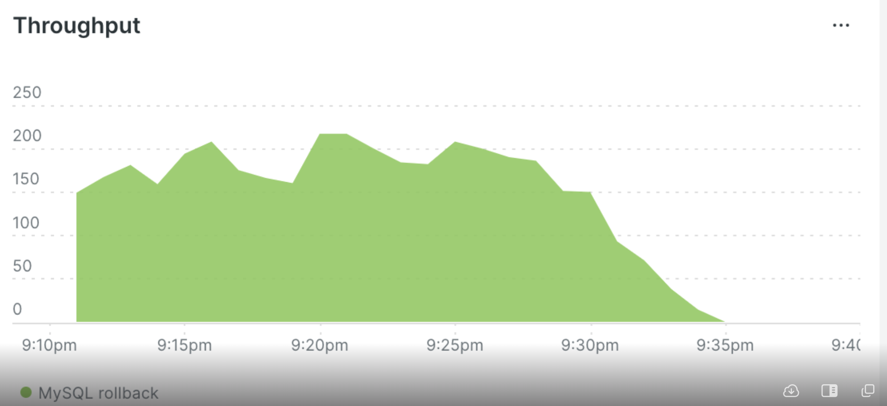

# 2023 회고

작성일: 2023-12-30

## 2022 회고를 회고하기

[2022 회고에서 설정했던 2023의 목표](https://github.com/taypark/til/blob/master/retrospective/2022.md#2023%EB%85%84-%EB%AA%A9%ED%91%9C)

4개의 목표 중 어느정도 달성했는지 회고해보면 좋을것 같다

1. ops 지식 더 쌓기 🤔
    - 작년에 K8s 를 더 배워보자고 썼었다. K8s 는 아직 미지의 영역이다(kubectl 같은걸 안 써봤다. 애초에 쓸 기회도 없었고...)
    - 사내 인프라가 ECS 에서 EKS 로 점진적으로 옮겨가고 있다. 그래서 helm chart 에서 사용하는 chart.yaml, values.yaml 등을 읽어보며 어떤 env 를 채워줘야 하는지, 어떤 권한이 필요한지, ArgoCD 는 어떻게 사용하면 되는지 정도는 써보고 있다. 권한 부족에 대한 프로세스 등은 있어서 할 수 있는데까지 해보고 요청하는 방법으로 하고있다.
    - 2024년에는 EKS 로 더 많이 옮겨갈 것이다. 더 배워야한다.
2. 의도적으로 시간을 조금씩 비우기 🤔
    - 부분적으로는 성공한 것 같다. 보고있는 코드에서 리팩토링이 필요한 부분은 조금 더 공격적으로 개선하고 작업을 이어나가는 식으로 사용했다.
    - 그런데 hard due 가 있는 작업을 올해 많이 맡으면서 그러지 못했다. 또한 그 이후에 작업하는 패턴이 조금 바뀌면서 여유를 주지 못했다.
3. 코드 좀 잘 짜기 ✅
    - 3분기부터는 많이 좋아졌다고 느낀다. 나름 읽을만한 코드가 되었는지 코드 리뷰 시간도 굉장히 줄었고, 팀원간 신뢰도 많이 쌓인것 같다.
        - 올해는 큰 작업들을 맡으면서 코딩을 정말 많이 했는데, 그 덕에 많이 발전한 것 같다. 역시 많이 짜야하나보다.
        - 그리고 작년에 비해 오픈소스를 까보는 일이 잦아졌는데, 그 덕도 있는것 같다.
4. 쌓인 책 읽기 ✅
    - 쌓인 책도 읽었다. 새롭게 산 책도 읽었다. 회사에 있는 책도 읽었다. 전역 이후에 가장 책을 많이 읽은 해가 아닐까 싶다. 군대있을 때 책을 많이 읽었어서..
    - 쌓인 책 읽기는 읽고 방치하는 것을 그만두기 위해서였던것 같은데, 지금 돌이켜보면 이런 이유들이 있는것 같다.
        1. 영상과 헤어지기, 글과 친해지기
        2. 개발이 아닌 다른 지식도 습득하기. 올해는 고전, 채용, PM/PO, 일하는 방법 등 여러가지를 읽었다. 물론 3분기부터 읽어서 많이 읽진 못했다.
            - 그 중에 가장 인상이 깊었던 책은 `귀곡자`라는 고전이다. 처세술과 관련된 책인데 정말 재미있게 읽었다.

작년 회고의 회고를 정리하자면

1. K8s 공부와 인프라 지식에 대해 공부할 때가 되었다. 새로이 책을 구매하거나 오픈채팅방 등에서 좋은 자료를 찾아서 1월부터 공부를 시작하자. `실습 위주로!`
2. 의도적으로 시간을 비우는건 조직의 변화가 일부 생겨서 일단 적응해보고 적용하자.
3. 코드는 이대로만 성장하자. 대신 남들의 코드를 더 많이 보자.
4. 책은 계속 읽자. 영상 매체 적당히 보고.

## 분기별 했던 일 정리

### 1분기

1. 연초이다보니 비용개선이나 가시성 개선에 많은 서포트를 했다. 적절한 RI 수가 얼마인지, right scaling target value 가 얼마인지 등등을 계산해서 보고하고 실제 구매까지 이어졌다. 지금은 또 트래픽이 늘어서 upfront 로 사용하는걸로 기억하는데, 다음 주에 다시 계산해야할 지도 모른다.
    - 트래픽 늘어날걸 생각해서 겜또(?)를 잘 때리도록 추천해보는것도 괜찮겠다.
2. 연초에는 작업은 기억나는 작업은 별로 없었고, 인프라 관리를 조금 더 했던것 같다.

### 2분기

1. 고객사 요청으로 `신규 기능`을 개발해야했는데, 가장 큰 컴포넌트의 로직을 크게 변경하는 일을 했다. 그러면서 구조적 개선을 많이 하고, 버그 리포팅도 하고, 기획에도 일부 도움을 드렸다. 이 때 코드를 많이 짜면서 코드 보는 눈이 좀 생긴것 같다.
2. 이때부터 리팩토링에 눈이 뜨면서 비슷한 로직을 수행하는 여러 컴포넌트의를 공통 클래스로 빼려는 노력을 했던것 같다. 지금도 많이 부족하고 구조적 개선을 더 해야한다.
    - 비슷한 노력으로 "스펙의 통일성 고려"하는 것을 3, 4분기에도 진행했다. 스펙이 흩어져있는 것들이 많아서 통일하면서 CSM/PM 과 커뮤니케이션하기 좋아졌다고 생각한다.
3. 반기 평가에서 좋은 평가를 받았다. 그만큼 나에 대한 기준이 높아진 것이니 더 열심히 해달라고 했던게 기억난다.

### 3분기

1. 사내에서는 새로운 카테고리를 위한 세일즈를 시작하느라 많은 노력을 기울였다. 당연히 나도 가세를 해야했고, 모든 작업을 제치고 최우선순위로 기용되었다. 야근도 많이 했고, 몸도 많이 피로했다.
2. 트래픽이 늘어나면서 RDB 에 부하가 심해졌는데, 이를 개선하기 위해서 2가지 작업을 했다.
    - 빠져있던 쿼리 캐싱을 하면서 여러 replica 의 전체 CPU 를 5% 정도 낮췄다. 
        - 
    - rollback 쿼리를 하지 않도록 바꾸면서 active session 이 replica 당 150 에서 3으로 크게 줄었다. 아래는 rollback query 요청 수이다.
        - 
    - 어떻게 했나?
        1. 파이썬 컴포넌트라서 sqlalchemy 를 사용하는데, create_engine + sessionmaker 조합으로 만든 세션은  `autocommit=False` 가 기본 옵션이다. 이때 transaction 을 자동으로 시작하게된다. 이 옵션을 해제했다.
            - `autocommit=True`
            - `isolation_level="AUTOCOMMIT"`
        2. sqlalchemy 는 기본적으로 connection pool(이하 cp)를 사용한다. 커넥션을 반납하는 과정에서 커넥션에 붙어있는 트랜잭션 상태들을 제거하기 위해 기본적으로 Reset On Return(rollback)을 한다. 1번을 했는데도 불구하고 rollback 을 호출한 것이 이 이유였다. 그래서 cp 반납할 때 rollback 을 호출하지 않도록 옵션을 수정했다.
            - `create_engine(pool_reset_on_return=False)`. 참고로 None 으로 해도 같다.
    - 아무튼 이 작업 이후에 RDB 이슈는 발생하지 않았다. 이때 비해서 지금의 트래픽은 20~30% 정도 늘었는데도 아직 알럿이 없다.
3. 자주 배포하는 컴포넌트의 컨테이너 이미지 사이즈를 약 `20%`로 줄이는 것도 해봤다. 체감상 컴포넌트가 뜨는게 조금 빨라진거 같긴 하다. 최근에 Max running tasks(배포할 때 최대로 뜰 수 있는 비율) 도 늘렸는데 배포가 빨라져서 만족스럽다. 어떻게 했냐면
    1. linux codename(bullseye 같은) 이 지정된 python 이미지를 사용해서 다 때려박았는데(?) 이걸 builder stage 에서 필요한 패키지, 의존성 등을 모두 다운받고 설치/빌드한 다음에
    2. `--mount=type=bind,target=/wheels,from=builder,source=/wheels` 등으로 prod stage 에 마운트해서 사용했다.
        - 이 때 apt update 한 의존성(/etc/apt/sources.list.d)도 넘겨주고 apt install 을 하면 prod stage 에서 apt update 할 필요가 없다.
    3. 그 외에 `apt install --no-install-recommends`을 명시, debian 패키지 사이트에서 필요한 의존성만 선택하여 사용하는 것도 꽤나 이미지 사이즈를 줄여줬다.
4. 3분기부터 `책`을 많이 읽기 시작했다. "도파민 디톡스"같은 해외 영상을 보면서 영상 매체에 조금씩 멀어지려고 노력하기 위한 일환으로 책을 읽었다. 대신 기술보다는 다른 분야를 많이 읽으려고 했다.
    - 프로덕트 오너
    - 프로덕트 매니지먼트
    - 귀곡자
    - 누구를 어떻게 뽑을 것인가
    - 소프트웨어 장인
5. 그 외에도 여러 개선점을 찾아서 리포트하고 개선했다. APM 에 남는 로그의 가시성을 높이거나, 패키지 업그레이드로 인해 발생하는 버그를 수정하거나, 등등.

### 4분기

1. 3분기에 하던 세일즈 서포트를 계속 했다. 한 번은 야근 중에 세일즈에서 급건이라며 나에게 직접 전화하는 일도 있었다. 이 때가 20시쯤이었는데 1시쯤에 나머지 동료들과 함께 퇴근했던거 같다. 
2. 스펙 가시성 개선과 통일에 힘을 썼다.
    - 여러 서드파티의 스펙이 다른 것을 통일하거나, 알럿 메시지를 enrich 한다거나, 코드 리팩토링 등도 포함된다.
3. 밴치마크같은걸 해봤다. 내부 컴포넌트 중 json marshal/unmarshal 을 많이 하는 컴포넌트가 있는데, built-in json 이 아니라 orjson 이라는 서드파티 패키지를 도입해보고자 PoC 를 해봤다.
    - 주말에 날 잡고 100만개 정도 이벤트를 돌려보면서 소요 시간과 json 빌드 결과를 비교했는데, diff 도 있었고 결과가 미미(한자릿수)해서 적용은 못했다.
    - 차라리 Python 3.12 를 하는게 좋겠다고 생각했다(3.11 쓰고있음)
    - 다음에 더 잘 하려면 벤치마킹하는 도구를 따로 써보면 좋겠다고 생각하고 있다.
4. 사내 중요 컴포넌트를 맡고있는 만큼 스펙 정리와 공유를 위해 문서화와 세션을 진행했다.
    - 1년동안 쿼리 파일만 195개를 만들었다 😇
        - 대고객사 데이터 비교용, 작업 적용전 PoC, 등등 있었겠지만 문의가 90% 이상일듯
    - 그래서 문의 컨텍스트를 공유하고 커뮤니케이션 비용을 줄이기 위해 진행했다.
    - 앞으로 컨텍스트 관련하여 현상만 이야기하고 어떻게 할지만 이야기하는 수준으로 커뮤니케이션 비용을 많이 낮췄다.
        - 궁금한 부분이 있으면 문서 링크만 남겨주는 것으로 해결이 가능해서 내 시간도 많이 확보할 수 있었다.
5. 건강검진 중 수면 내시경을 하다가 안압이 높아지면서 실핏줄이 많이 터졌다. 검진하고 2주가 지났는데 아직도 붉다. 올해 일을 너무 많이해서 그런건지, 병원에서 약을 덜 넣은건지 모르겠으나... 비수면을 권장한다고 한다. 내가...될까? 😇

### 그 외

- 소소하게 개선사항들을 센싱하고 처리했다.
- 인프라 개선들을 하면서 비용을 줄이고 돈 내고 쓰는 리소스를 최대한으로 쓰도록 노력했다. 심심할 때마다 APM 이나 Grafana 봤던게 여기서 돌아오나보다.
- 나름 컨텍스트가 많은 사람이 되었다. 그래서 다른 사람들이 물어보는 것들을 많이 대답했다. 물론 문의도 많이 받았다.
- Year-End Party 에서 Happy to help 상을 받았다. 선물(사케)도 받았는데 누가 주신건지 모르겠다. 누군지 알아야 같이 마시던가 할텐데... 일단은 사물함에 있다.
- 온보딩 문서는 "draft" 와 "outdated" 상태밖에 없다는 말을 얼핏 봤다. 문서를 쓴건 쓴거지만 작년의 내가 작성한 문서도 1년동안 거의 안 읽었고 수정도 안 했다(오히려 다른 분들이 보고 수정해주셨다.) 이번에는 outdated 가 되지 않도록 노력해야겠다. 다른 사람들 푸시도 하고.
- 대신 집중을 못하는 상황에서 어떻게 책을 읽을지가 조금 관건인데, 집중을 어떻게 잘 할 수 있을지 고민해봐야겠다. 연말에 Reflection On Action 이 아니라 `Reflection In Action(RIA)` 이라는 개념을 알게됐는데, 이걸 적용해보면 좋을 것 같다.
- 올해 두 번 몸이 크게 안 좋았다. 운동을 시작하면서 건강을 챙기자.
- 한 번 집중하면 의자에서 안 일어나는 성격이다. 이 일을 오래 하려면 목도, 허리도 건강해야하는데 자주 일어서도록 해야겠다(물을 더 많이 먹던가...)

## 2024 목표

숫자가 하나 바뀐다고 목표를 설정하는게 무슨 의미가 있는지 잘 모르겠다는 글을 보긴 했는데... 그래도 의미를 적게나마 두어보자면

1. 운동을 시작하고 체력과 몸에 신경쓰자. 아프면 쉬고, 좋은 것을 많이 먹자.
2. 책을 계속 읽자.
3. 새로운 것을 배우자. 새로운 것을 배우면서 새로운 것을 만들어보자.
4. 자기 브랜딩에도 신경을 써야할 때가 된 것 같다. 회사 개발 블로그에 글을 써보자. 아님 발표를 해보던가...?
    - 이건 좋은거만 보다보니 기준이 많이 높은데, 그래도 시도는 해보자.
